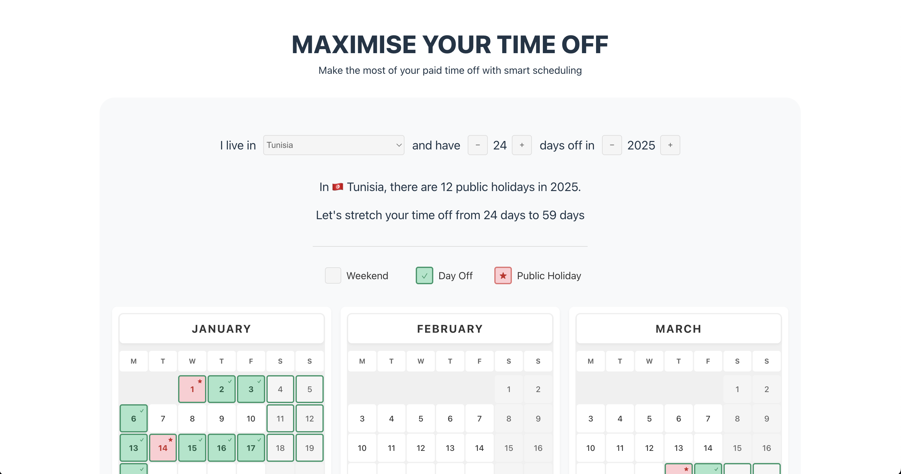

# Max Days Off

**Max Days Off** is a holiday optimizer built with **React**, **TypeScript**, and **Vite**. It helps users maximize consecutive days off by intelligently assigning PTO (paid time off) around weekends and public holidays.



## Features

- Generate an optimized PTO schedule for a given year.
- Consider weekends and public holidays.
- Interactive UI with numeric inputs and year selection.
- Supports multiple countries and regions.
- Easily adjust the number of PTO days.

## Installation

1. Clone the repository:

```bash
git clone https://github.com/rabiibouhestine/max-days-off.git
cd max-days-off
```

2. Install dependencies:

```bash
npm install
```

3. Start the development server:

```bash
npm install
```

Open http://localhost:5173 to view it in your browser.

## Usage

1. Select your country (and region if available).
2. Enter the number of PTO days you want to take.
3. Adjust the year using the + and - buttons.
4. The calendar will display optimized days off, highlighting PTO, holidays, and weekends.

## Technologies Used

- React for UI.
- TypeScript for type safety.
- Vite for fast development and HMR.
- ESLint for code quality.

## Contributing

Feel free to open issues or submit pull requests. Suggestions for additional features or improvements are welcome!
